# agentic-php-debug — Software Design Document

> **Audience.** Someone who has never opened this repository and needs to understand *what the
> objects are, who owns whom, and what happens on the wire* before touching code.
> Every diagram below is followed by a "how to read it" note, so no diagram depends on
> knowledge from outside this file.

---

## 1. What this system is

`agentic-php-debug` lets an **AI agent drive a real PHP debugger**. It is a protocol translator
sitting between two worlds:

| Side | Protocol | Who talks it |
|---|---|---|
| Agent side | **MCP** — Model Context Protocol (stdio or Streamable HTTP+SSE) | Claude, Copilot, any MCP client |
| Debugger side | **DAP** — Debug Adapter Protocol (`Content-Length`-framed JSON) | `vscode-php-debug`'s `phpDebug.js`, which in turn speaks **DBGp** to Xdebug |

The core idea that shapes the whole design: **one `DebugBackend` interface, two implementations.**
Everything above that interface — the session state machine, all 21 tool handlers, the breakpoint
ledger, path mapping — is written once and runs unchanged in a headless CLI server *and* inside a
VS Code extension.

### 1.1 System context

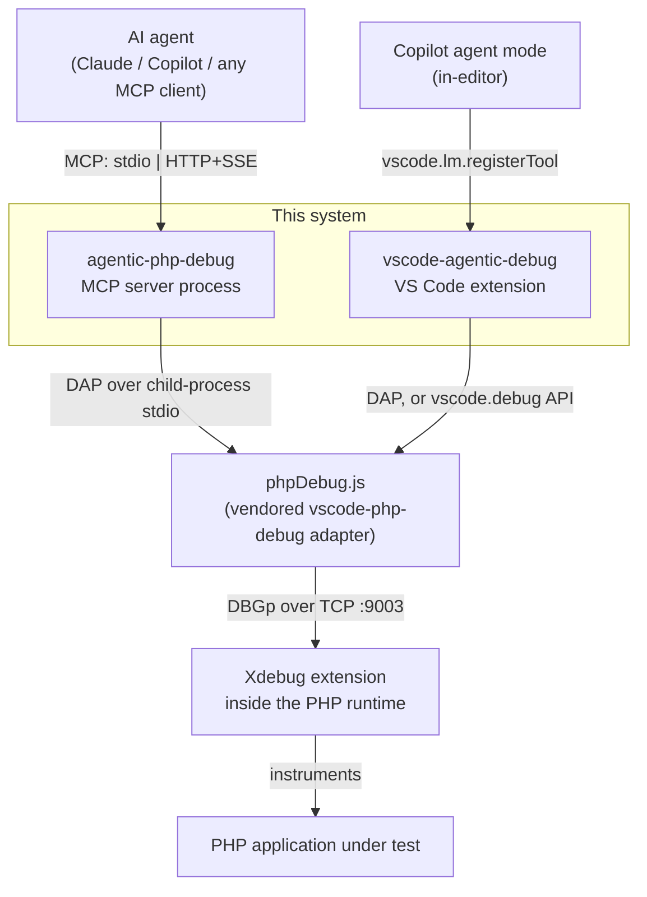

**How to read it.** Two entry points (a standalone process, an extension) converge on the same
adapter. Note the direction of the DBGp link: **Xdebug dials out to the adapter**, the adapter
listens. That inversion is the single most common source of confusion when configuring this stack —
`port` in the config is a *listen* port, not a connect port.

---

## 2. Package view

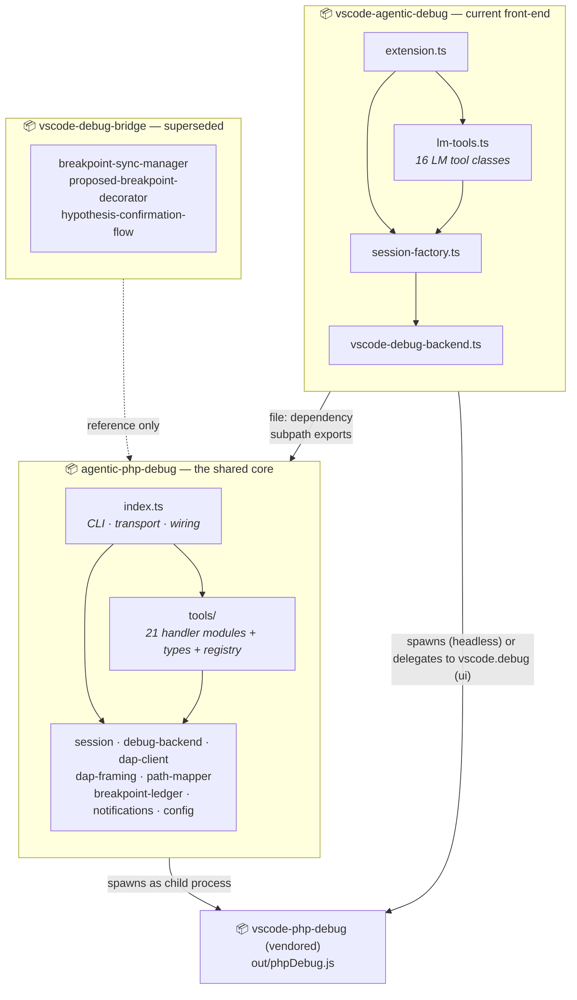

**How to read it.** Arrows are *build- and run-time dependencies*. The core knows nothing about the
extensions — dependency flows one way only. The extensions consume the core through an explicit
`exports` map in `package.json` (`agentic-php-debug/session.js`, `agentic-php-debug/tools/debug-variables.js`, …),
which means **the core must be built (`npm run build`) before either extension compiles.**

| Package | Role | Status |
|---|---|---|
| `agentic-php-debug` | Session state machine, DAP client, tool handlers, MCP server | **Active — the core** |
| `vscode-agentic-debug` | VS Code ≥1.95 extension; 18 Language Model Tools for Copilot agent mode | **Active — current front-end** |
| `vscode-debug-bridge` | First attempt: MCP server hosted *inside* VS Code | Superseded; kept for its breakpoint-sync and hypothesis-confirmation ideas |
| `vscode-php-debug` | Vendored upstream DAP adapter, used as `out/phpDebug.js` | Vendored dependency, not modified |

---

## 3. Class diagrams

### 3.1 Core — session, protocol, and infrastructure

```mermaid
classDiagram
    direction LR

    namespace core_session {
        class SessionManager {
            -SessionState _state
            -StopInfo _stopInfo
            -number _suspensionId
            -number _launchCount
            -Map stoppedThreads
            -Set liveThreads
            -Map issuedFrameIds
            -Map issuedVarRefs
            -Array pendingEvents
            -OutputRecord[] outputRing
            -Map verifications
            -QueuedBreakpoint[] queuedBreakpoints
            -Array registeredHandlers
            +dapClient DebugBackend
            +pathMapper PathMapper
            +sessionConfig Config
            +state SessionState
            +stopInfo StopInfo
            +suspensionId number
            +launchCount number
            +status SessionStatus
            +launch(progressToken, overrides) SessionStatus
            +terminate() void
            +syncFromExternalSession() SessionStatus
            +assertState(allowed) void
            +suspensionIdFor(threadId) number
            +markResumed(threadId, observedSuspensionId) boolean
            +takePendingEvent() Event
            +clearPendingEvents() void
            +noteIssuedFrameIds(ids) void
            +noteIssuedVariablesReferences(refs) void
            +staleFrameSuspension(frameId) number
            +staleVariablesReferenceSuspension(ref) number
            +markBreakpointsStaged(ids) void
            +getVerification(id) VerificationRecord
            +noteRequestTimeout(command, timeoutMs) void
            +queueBreakpoint(command, args) void
            -recomputeSuspension() void
            -registerEventHandlers() void
            -unregisterEventHandlers() void
            -bufferEvent(event) void
            -assertStillLaunching() void
            -setState(newState) void
        }
        class SessionState {
            <<enumeration>>
            NotStarted
            Initializing
            Listening
            Connected
            Paused
            Terminated
        }
        class SessionStateError {
            +SessionState[] allowed
            +SessionState actual
        }
        class SessionStatus {
            <<interface>>
            +SessionState state
            +StopInfo stopInfo
            +boolean adapterAlive
            +number adapterPid
            +number pendingEventCount
            +number queuedBreakpointCount
            +number[] stagedBreakpointIds
            +Array breakpointVerifications
            +Array stoppedThreads
            +number[] liveThreadIds
            +number suspensionId
            +OutputRecord[] recentOutput
            +number droppedOutputCount
            +object lastRequestTimeout
        }
        class StopInfo {
            <<interface>>
            +string reason
            +number threadId
            +string description
            +boolean allThreadsStopped
        }
        class NotificationSender {
            <<interface>>
            +sendProgress(token, progress, total, message) void
            +sendLog(level, message, data) void
            +sendDebugEvent(event, details) void
        }
    }

    namespace core_protocol {
        class DebugBackend {
            <<interface>>
            +onTrace callback
            +onStderr callback
            +onRequestTimeout callback
            +onLateResponse callback
            +initialize() InitializeResponse
            +launch(config) LaunchResponse
            +configurationDone() ConfigurationDoneResponse
            +sendRequest(command, args, timeout) Response
            +disconnect() void
            +onEvent(name, handler) void
            +offEvent(name, handler) void
            +onAnyEvent(handler) void
            +waitForEvent(name, timeout) Event
            +isAlive() boolean
            +getStatus() BackendStatus
            +getSeq() number
        }
        class DAPClient {
            -string adapterPath
            -ProcessSpawner spawner
            -ChildProcessLike process
            -DAPStreamParser parser
            -Map pending
            -Map abandoned
            -Map eventHandlers
            -EventHandler[] anyEventHandlers
            -number seq
            -string[] stderrChunks
            -boolean terminalEventSeen
            +number defaultTimeout
            -handleMessage(msg) void
            -dispatchEvent(event) void
        }
        class DAPTimeoutError {
            +string command
            +number timeoutMs
        }
        class DAPRequestError {
            +string command
            +number requestSeq
            +Message dapMessage
        }
        class DAPStreamParser {
            <<EventEmitter>>
            -Buffer buffer
            -number contentLength
            -onData(chunk) void
            -parse() void
        }
        class ProcessSpawner {
            <<interface>>
            +spawn(command, args) ChildProcessLike
        }
        class ChildProcessLike {
            <<interface>>
            +stdin WritableStream
            +stdout ReadableStream
            +stderr ReadableStream
            +pid number
            +on(event, listener) this
            +kill() boolean
        }
    }

    namespace core_support {
        class PathMapper {
            -PathMapping[] byLocal
            -PathMapping[] byRemote
            +toRemote(localPath) string
            +toLocal(remotePath) string
        }
        class PathMapping {
            <<interface>>
            +string local
            +string remote
        }
        class McpNotificationSender {
            -McpServer server
        }
        class BreakpointLedger {
            -Map entries
            +addAgentBreakpoints(hypothesisId, locations) void
            +addIdeBreakpoints(breakpoints) void
            +removeIdeBreakpoint(file, line) void
            +removeByHypothesis(hypothesisId) string[]
            +removeAllAgentBreakpoints() string[]
            +clearIdeBreakpoints(file) void
            +getForFile(file) LedgerEntry[]
            +getAll() LedgerEntry[]
            +getByHypothesis(hypothesisId) LedgerEntry[]
            +getContext() BreakpointContext
            +findEntryAt(file, line) LedgerEntry
            +syncToDAP(files, vsCodeSync) void
        }
        class LedgerEntry {
            <<interface>>
            +string file
            +number line
            +string condition
            +BreakpointSource source
            +number hypothesisId
            +string annotation
            +boolean verified
        }
        class Config {
            <<type: z.infer of ConfigSchema>>
            +string adapterPath
            +number port
            +string hostname
            +boolean stopOnEntry
            +Record pathMappings
            +string runtimeExecutable
            +number maxConnections
            +XdebugSettings xdebugSettings
            +ProxySettings proxy
            +StreamSettings stream
            +boolean log
        }
    }

    DAPClient ..|> DebugBackend : implements
    McpNotificationSender ..|> NotificationSender : implements
    DAPClient *-- DAPStreamParser : owns
    DAPClient --> ProcessSpawner : injected
    ProcessSpawner ..> ChildProcessLike : creates
    DAPClient ..> DAPTimeoutError : throws
    DAPClient ..> DAPRequestError : throws
    SessionManager --> DebugBackend : commands
    SessionManager --> PathMapper : holds
    SessionManager --> NotificationSender : emits via
    SessionManager --> Config : configured by
    SessionManager --> SessionState : owns
    SessionManager ..> SessionStateError : throws
    SessionManager ..> SessionStatus : produces
    SessionManager ..> StopInfo : produces
    PathMapper o-- PathMapping : sorted by prefix length
    BreakpointLedger --> DebugBackend : syncToDAP
    BreakpointLedger --> PathMapper : toRemote
    BreakpointLedger o-- LedgerEntry : keyed by file
```

**How to read it.** Three namespaces = three concerns.

- `core_session` is **policy**: what state the debugger is in and what is legal to do next.
  It talks only to interfaces (`DebugBackend`, `NotificationSender`), never to a process.
- `core_protocol` is **mechanism**: bytes on a pipe. `DAPClient` is the only class in the whole
  core that knows a child process exists, and even that is behind `ProcessSpawner` so tests can
  inject a fake.
- `core_support` is **stateless or bookkeeping helpers** that neither side owns exclusively.

The dashed `..|>` arrows are the seams. Everything the system does for testability, for the VS Code
port, and for future adapters flows through those two interfaces. A third seam, `ToolInvoker`,
sits above the handlers (§3.5).

Most of `SessionManager`'s members exist to keep its view of the target honest:

- **Suspension epochs.** `suspensionId` is bumped by every `stopped` and never reset.
  `markResumed` and the `stale*Suspension` checks compare against it. State is derived from the
  per-thread `stoppedThreads` map by `recomputeSuspension`, the single writer (§4).
- **Event buffer.** `pendingEvents` holds events that land between two tool calls, so
  `debug_wait` can replay them (§5.4).
- **Diagnostics.** `outputRing`, `verifications` and `lastRequestTimeout` are what
  `SessionStatus` reports instead of guessing.

Errors are classes, not strings. `toolError` (`tools/errors.ts`) dispatches on
`SessionStateError`, `StaleReferenceError`, `DAPTimeoutError` and `DAPRequestError`, so a handler
never has to match on message text.

### 3.2 Core — the tool layer

Tool handlers are *modules*, not classes. Each `tools/debug-*.ts` exports the same three symbols.
`tools/registry.ts` binds them into one table of `ToolDefinition` entries. That table is the single
list of what the core offers: the MCP server registers it, and the plan invokers call it (§3.5).

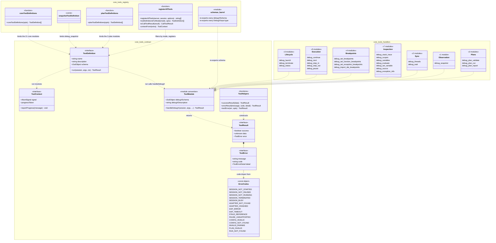

**How to read it.** The `<<module convention>>` box is not a real TypeScript type. It is the
contract every handler file honours by naming convention. `ToolDefinition` *is* a real type: it
binds a module's three symbols to a tool name and a uniform `run(session, args, ctx)`. Registration,
schema export and plan execution are each a mechanical loop over that table. `ToolContext` carries
what varies per call: the cancel signal `debug_wait` blocks on, the MCP progress token, and the
progress sink `debug_plan_run` reports to.

What the MCP server registers depends on `--mode`:

| `--mode` | Tools | Registered |
|---|---|---|
| `react` (default) | everything except `debug_plan_run` and `debug_plan_report` | 23 |
| `plan` | `debug_status`, `debug_plan_validate`, `debug_plan_run`, `debug_plan_report` | 4 |
| `all` | the 21 core tools, `debug_snapshot` and the 3 plan tools | 25 |

`debug_wait` is one of the 21 core tools and is registered over MCP in `react` and `all` modes.
`registerAllTools` turns the SDK's `AbortSignal` into the `WaitSignal` it blocks on
(`toWaitSignal`). It also gives `debug_status` the list of registered names, so its advice only
names tools the client can actually call.

The VS Code extension's LM tool classes are the one path that does *not* go through the table:
they call the `handleDebugX` functions directly (§3.3). Their manifest schemas are still
generated from the same Zod, by the extension repo (§6.9).

### 3.3 `vscode-agentic-debug` — the VS Code front-end

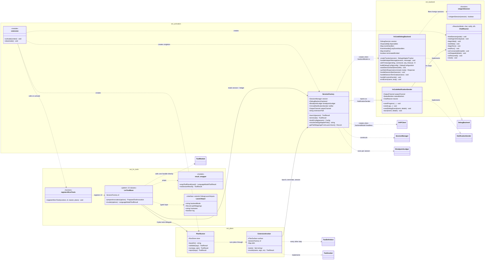

**How to read it.** Boxes drawn *outside* the four namespaces (`SessionManager`, `DAPClient`,
`BreakpointLedger`, `DebugBackend`, `NotificationSender`, `ToolModule`, `ToolDefinition`,
`ToolInvoker`) belong to the core package. They appear here only as the targets of this package's
dependencies.

The extension adds **no debugging logic**. It contributes:

1. `SessionFactory` — a singleton session plus a three-tier config merge
   (tool params → `agenticDebug.*` settings → hardcoded defaults, with `pathMappings` also read from
   `launch.json`). It also picks the backend per launch.
2. `VsCodeDebugBackend` — the second `DebugBackend` implementation, driving `vscode.debug.*`.
   `isAgentSession` keeps it to sessions of this extension's own debug type (`php-agentic`); a
   developer's own `php` sessions are left alone.
3. `VsCodeNotificationSender` — the second `NotificationSender`. It writes to an output channel and
   the status bar instead of MCP notifications. It hands stops to `ChatReactor`, which turns a stop
   no tool call is waiting for into a Copilot Chat turn, a notification, or nothing
   (`agenticDebug.reactOnBreak` / `reactOnConnect`: `chat`, `notify` or `off`).
4. `PlanRunner` + `ExtensionInvoker` — the third `ToolInvoker` (§3.5). A plan runs on the editor's
   session: launch and terminate go through `SessionFactory`, every other step through the core
   `ToolDefinition` table.
5. Twenty-two thin LM tool classes (19 session tools + 3 plan tools). Each `invoke()` is one guard
   plus one call. Most call a core `handleDebugX` function. `debug_launch` and `debug_terminate`
   call `SessionFactory`, `debug_breakpoints_get` reads the `BreakpointLedger`, and the three plan
   tools call `PlanRunner`.

### 3.4 The two backends side by side

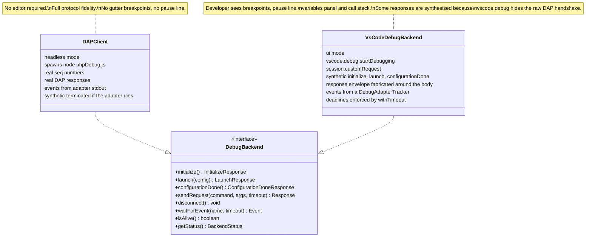

**How to read it.** The asymmetry is deliberate and is the main design tension in this codebase.
`VsCodeDebugBackend` cannot observe the real DAP handshake — VS Code owns it — so it **fabricates**
the `initialize`, `launch` and `configurationDone` responses.

Events are no longer part of that asymmetry. A debug adapter tracker taps the adapter's real
output, so `stopped`, `continued`, `thread`, `output` and `terminated` reach `SessionManager` exactly
as they do in headless mode. The 500 ms poller this replaced is gone for good reasons (§5.4,
*Backend symmetry*).

What is still lossy is request results. `customRequest()` resolves with the response *body* only,
so `success: true` is fabricated and a failed request arrives as bare text. That is why `toolError`
cannot attach a DAP `detail` in UI mode. `customRequest()` also has no timeout, so the backend
enforces the caller's deadline itself (`withTimeout`). It throws the core's own `DAPTimeoutError`,
so both backends report a timeout the same way.

Any behaviour that depends on exact DAP sequencing works in headless mode and must be re-verified
in UI mode.

### 3.5 Plan runs — the `ToolInvoker` seam

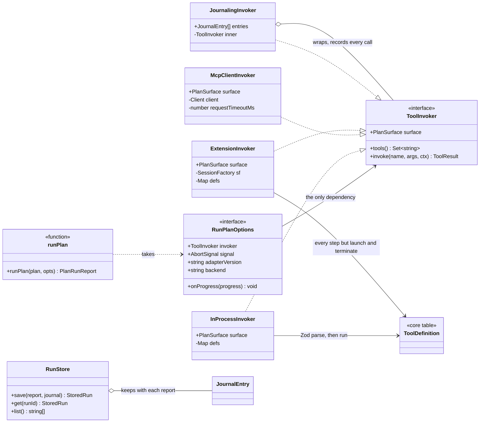

**How to read it.** A plan is "just tools". `runPlan` depends on nothing but a `ToolInvoker`, so
one plan runs unchanged in-process (`surface: in-process`), through a spawned or running MCP server
(`mcp`), or on the VS Code extension's session (`extension`). `debug_plan_run` wraps whichever
invoker it gets in a `JournalingInvoker` and saves the report with its journal in a `RunStore`,
which is what `debug_plan_report` reads back.

`InProcessInvoker` runs each tool's own Zod schema before calling it, as the MCP server would. So
an in-process run still catches a plan the schemas no longer accept. The run algorithm, the
invariants and the golden-file comparison are in §5.5.

---

## 4. Session state machine

`SessionManager` owns the state. `setState()` is the only writer. Stop and resume transitions go
through `recomputeSuspension()` (`session.ts:285`), which works the state out from the set of
suspended threads.

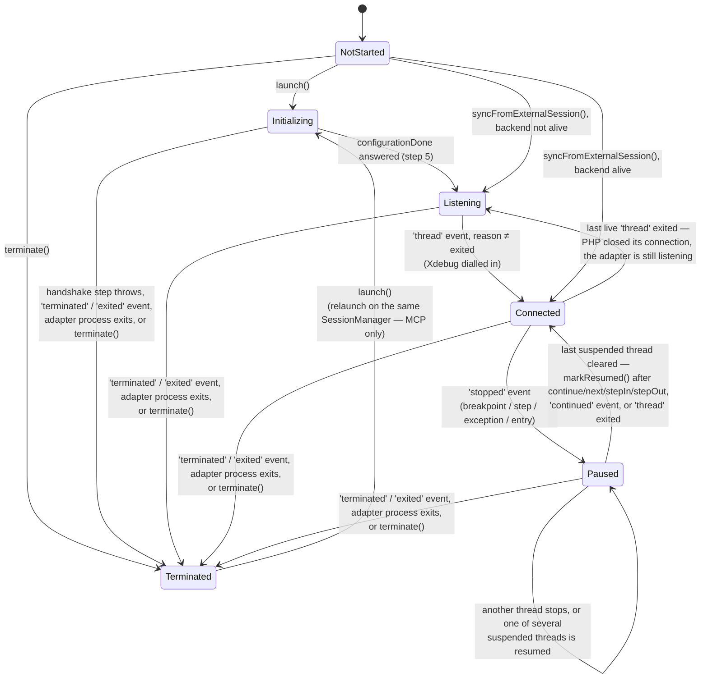

The **guard admits** column lists the tools whose `assertState` passes in that state. Five
handlers have no guard and can be called in **every** state: `debug_launch`, `debug_terminate`,
`debug_status`, `debug_wait` and `debug_import_ide_breakpoints`.

| State | Meaning | Guard admits (in addition to the five unguarded tools) |
|---|---|---|
| `NotStarted` | No adapter process yet | — |
| `Initializing` | Handshake in flight | — |
| `Listening` | Adapter up, waiting for Xdebug to dial in — first time, or again after the last connection closed | the three breakpoint setters (sent immediately, never queued) |
| `Connected` | Xdebug attached, PHP running | breakpoint setters (staged by the adapter until the next pause), `debug_pause`, `debug_threads`, `debug_source` |
| `Paused` | At least one thread suspended | breakpoint setters, `debug_threads`, `debug_source`, `debug_continue` / `debug_next` / `debug_step_in` / `debug_step_out`, `debug_stack_trace`, `debug_scopes`, `debug_variables`, `debug_evaluate`, `debug_set_variable`, `debug_exception_info` |
| `Terminated` | Session over | — (`debug_launch` starts a new one) |

Edges the diagram simplifies:

- **Any stop goes to `Paused`.** `recomputeSuspension()` moves every non-`Terminated` state to
  `Paused` when a thread is suspended. A `stopped` event that arrives before `thread` therefore
  skips `Connected`. vscode-php-debug always sends `thread` first (`phpDebug.ts:636`), so this does
  not happen in headless mode.
- **`'continued'` has two sources.** vscode-php-debug sends it only from `disposeConnection`
  (`phpDebug.ts:663`), right before `ThreadEvent('exited')`. The UI backend's poller *invents* one
  (`vscode-debug-backend.ts:301,307`). The handler removes one thread from the suspended set, or all
  of them when `allThreadsContinued` is set or `threadId` is missing. A late copy does nothing.
- **Only `Terminated` is sticky.** The `'terminated'` / `'exited'` handlers and `terminate()` set
  it from any state. `recomputeSuspension()` and `markResumed()` refuse to leave it. Only `launch()`
  and `syncFromExternalSession()` can.
- **`syncFromExternalSession()` is unguarded.** It sets `Listening` or `Connected` from *any* state,
  not only `NotStarted`. Its only caller is the superseded `vscode-debug-bridge`. Neither shipped
  front-end calls it.
- **`launch()` is also unguarded.** In headless mode, relaunching while an adapter is alive fails
  before `launch()` runs, because `handleDebugLaunch`'s port probe sees the port in use. In UI mode,
  `SessionFactory.launch()` terminates the old session and builds a **new** `SessionManager`, so a
  relaunch there never reuses a `Terminated` instance.

**A failed or aborted launch ends in `Terminated`.** `launch()` wraps steps 1–5 in a `try`
(`session.ts:463-561`). When any step throws, the `catch` does four things:
- calls `dapClient.disconnect()`, which frees the adapter and its port;
- clears the suspended threads and sets `Terminated`;
- logs `Launch failed: …`;
- rethrows, so `handleDebugLaunch` returns `DAP_ERROR`.

`debug_launch` can then be called again straight away. After every `await`, `assertStillLaunching()`
(`session.ts:568`) checks that the state is still `Initializing`. If a `terminate()` or a
`terminated` / `exited` event arrived during the handshake, it throws `Launch aborted: session
terminated`, so a late `configurationDone` cannot overwrite `Terminated` with `Listening`. This
matters most in UI mode, where `VsCodeDebugBackend.configurationDone()` ignores errors.

One limit remains: a terminate that arrives during the `initialized` wait takes effect only when
that wait ends, which can be up to 30s.

**An adapter crash ends the session.** When the child process exits on its own, `DAPClient`
rejects the pending requests and then sends a synthetic
`terminated { adapterExited: true, exitCode }` through the normal event path (`dap-client.ts:205`).
It skips this when the adapter already reported `terminated` or `exited`. The session moves to
`Terminated` and logs the exit code, and a `debug_wait` that is blocked returns on the event.
`VsCodeDebugBackend` already synthesizes `terminated` when VS Code ends its session.

**A relaunch registers exactly one set of handlers.** The backend outlives `terminate()`:
`DAPClient` keeps its handler map, and a relaunch respawns the adapter into the same client. So
`SessionManager` records every handler it registers and `terminate()` removes them with `offEvent`
(`unregisterEventHandlers()`, `session.ts:611`). Without that, each event would be processed twice
after a relaunch.

> ⚠ **The resume transition is the CLIENT's job, not the adapter's.** DAP states that "a debug
> adapter is not expected to send [a `continued`] event in response to a request that implies that
> execution continues, e.g. launch or continue", and vscode-php-debug emits `continued` only from
> `disposeConnection` (`phpDebug.ts:663`). So the four continuation tools call
> `SessionManager.markResumed(threadId, observedSuspensionId)` after a successful response. Before
> that existed the session stayed `Paused` with the *previous* `StopInfo`, `debug_wait` short-circuited
> to `already_paused`, and the agent's next `stack_get` queued behind the in-flight DBGp `run` until
> the 30s DAP timeout.
>
> `observedSuspensionId` is read **before** the request is sent. The adapter answers the continuation
> before issuing the DBGp command, and `DAPStreamParser.parse()` dispatches every message in a chunk
> synchronously — so a target that re-stops instantly delivers response and `stopped` together, and
> the guard is what stops `markResumed` clobbering the fresh stop. `markResumed` also refuses to leave
> `Terminated`, which the counter alone cannot catch because `terminated` does not bump it.

> ⚠ **`stopInfo` is derived, and stops are tracked per thread.** One Xdebug connection is one DAP
> "thread", and every stop carries `allThreadsStopped: false`, so resuming one does not resume the
> others. `SessionManager.stoppedThreads` holds them all; `stopInfo` is the most recently stopped one
> still suspended. `debug_status` reports `stoppedThreads` / `liveThreadIds` and warns when either
> exceeds one. The single global `assertState` guard is unchanged — a full per-thread state machine
> is still an open task.

> ⚠ **Object references die on resume.** DAP: "Once execution resumes, object references become
> invalid and DAP clients must not use them." vscode-php-debug does *not* enforce this —
> `stackTraceRequest` (`phpDebug.ts:1027-1029`) has its `clear()` calls commented out — so a stale
> `variablesReference` stays resolvable and re-issues `context_get -d <old level>` against the new
> stack, returning plausible wrong data. `SessionManager` tags every frame id and variablesReference
> it hands out with the suspension it belongs to and rejects a later reuse with `STALE_REFERENCE`.
> The check is fail-open: an id we never issued passes straight through, so it can never produce a
> false positive.

### 4.1 Two state mechanisms — a hard guard and an advisory map

These are independent, and conflating them is the easiest mistake to make in this codebase.

| | `session.assertState(...allowed)` | `allowedToolsByState` |
|---|---|---|
| Kind | **Hard guard** — throws | **Advisory map** — a hint for the model |
| Defined | `session.ts:428` | `tools/debug-status.ts:17` |
| Used by | The first line of **16 of the 21** handlers | Returned in every `debug_status` payload, via `allowedToolsFor()` |
| Consulted for rejection | Yes — `SessionStateError` → `SESSION_NOT_PAUSED` / `SESSION_NOT_STARTED` | Never; referenced only inside `debug-status.ts` and its tests |

The guard is what turns an illegal call into a structured error instead of a DAP timeout. The map is
what lets the model skip the illegal call altogether — the constraint arrives in the context window
*before* the call, which is cheaper than a failed round trip.

The five handlers with no guard are `debug_launch`, `debug_terminate`, `debug_status`, `debug_wait`
and `debug_import_ide_breakpoints`; none of them needs one.

> ⚠ **The two lists have drifted.** `allowedToolsByState` is written in *LM-tool* vocabulary.
> `allowedToolsFor()` removes `debug_breakpoints_get` unless the caller passes `includeLedgerTools`,
> which only the extension does, so the MCP server no longer advertises a tool it does not register.
> The map still **under**-advertises what the guards permit:
> - `Paused` leaves out `debug_source`, `debug_set_variable`, `debug_exception_info` and the
>   function/exception breakpoint setters.
> - `Connected` leaves out `debug_source` and those setters. It also leaves out `debug_pause`, but
>   that one is deliberate (see the comment at `debug-status.ts:21`).
> - `Listening` leaves out the function/exception breakpoint setters.
> - `Initializing` and `Terminated` leave out tools that have no guard.
>
> Deriving the map from the guards (or vice versa) is an open task.

---

## 5. Runtime sequences

### 5.1 Launch — the 5-step DAP handshake

The five steps are the `// Step N` comments in `SessionManager.launch()` (`session.ts:463-561`).
Progress notifications count 0/5 to 5/5 and are sent only when the client provided a
`progressToken`.

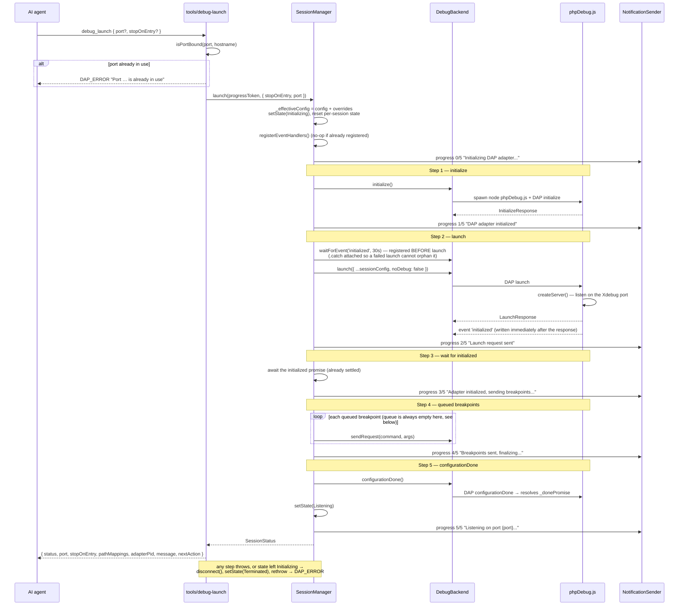

The diagram shows the headless `DAPClient` backend. In UI mode `VsCodeDebugBackend` sends no
`initialize` over the wire. It answers with a synthetic response, and its `launch()` calls
`vscode.debug.startDebugging`, then emits `initialized` itself before it returns.

**Why the ordering matters.** The `initialized` listener is registered *before* `launch` is sent,
and both backends need that:

- **Headless:** vscode-php-debug writes the launch response and `InitializedEvent` one after the
  other (`phpDebug.ts:512-514`). When both land in the same stdout chunk, `DAPStreamParser`
  dispatches the event synchronously, before the `await launch()` continuation runs.
- **UI:** `VsCodeDebugBackend.launch()` emits `initialized` inside its own call
  (`vscode-debug-backend.ts:94`), before it returns.

If the listener were registered after `launch`, it would miss the event and step 3 would time out
after 30s. Likewise, breakpoints must land strictly between `initialized` and `configurationDone`.
That is the window step 4 exists to use.

**A failure in steps 1–5 rolls back.** The adapter is disconnected, the state becomes
`Terminated`, and `handleDebugLaunch` returns `DAP_ERROR` (see §4). A promise that is not awaited
yet needs protection too. If `launch` throws, nothing awaits the `initialized` wait, so
`launch()` attaches a no-op `.catch` to it as soon as it is created. Otherwise its 30s timeout
would become an unhandled rejection, and under Node's default behaviour that crashes the
standalone MCP server.

#### Breakpoint setup — the part of the handshake that is easy to get wrong

DAP gives breakpoints exactly one *protocol-blessed* window: after the adapter emits `initialized`
and before the client sends `configurationDone`. That is step 4 of the sequence above, and
`SessionManager` serves it with a two-method pair:

| Method | `session.ts` | Role |
|---|---|---|
| `queueBreakpoint(command, args)` | `:451` | Park a DAP breakpoint request until a window exists |
| `flushQueuedBreakpoints()` | `:437` | Drain the queue through `dapClient.sendRequest`, logging — not throwing — per-request failures |

The queue is drained in **two** places:

1. **Inside `launch()`, step 4** — strictly between `initialized` and `configurationDone`. Unlike
   the flush, this loop *throws* on the first failed request, which aborts the launch.
2. **On the `Listening → Connected` transition**, from the `thread` event handler
   (`session.ts:756-760`). This drain was added because `launch()` finishes *before* the agent has
   had a chance to set anything. Without it, every breakpoint queued after launch stayed in the
   array forever. See [`specs/fix-queued-breakpoints-flush.md`](./specs/fix-queued-breakpoints-flush.md)
   for the original bug report.

> ⚠ **The queue is vestigial: nothing fills it.** `queueBreakpoint()` has no callers outside
> `flush-queued-breakpoints.property.test.ts`. `launch()` also empties the queue at the start
> (`session.ts:477`), so step 4 always loops over an empty array, and `queuedBreakpointCount` in
> `debug_status` is always 0 in production. Both drains are kept only in case the queue is used
> again.

**The shipped tools do not queue.** `handleDebugSetBreakpoints` (and its function/exception
siblings) `assertState(Listening | Connected | Paused)` and then send the request
**immediately**, in every one of those states, always returning `queued: false`. Deferring the send
to the `thread` event lost the race in practice: Xdebug connects, runs, and blows past the line
before a deferred request round-trips.

Sending while `Listening` — with no Xdebug connection in existence — is safe because of how the
vendored adapter is built, and this is the single most useful thing to know about the handshake:

```
phpDebug.ts:195   BreakpointManager   ← one per adapter process, outlives every connection
phpDebug.ts:641   new BreakpointAdapter(connection, this._breakpointManager)   ← one per Xdebug connection
breakpoints.ts:242  constructor → this._add(breakpointManager.getAll())        ← replays everything
```

Breakpoints live in the **adapter**, not in the connection. Each new Xdebug connection gets a fresh
`BreakpointAdapter` that immediately replays the manager's full set. So "set breakpoints, then
trigger the request" works, and so does the reverse order for any *subsequent* request. Registering
before the connection arrives is not a workaround — it is the supported path.

The adapter's per-connection sequence (`phpDebug.ts:636-656`) is what makes the ordering rule
concrete:

```
ThreadEvent('started')         :636   ← our `thread` event fires HERE, first
await this._donePromise        :639   ← resolved by configurationDone, once, at :994
new BreakpointAdapter(...)     :641   ← replays BreakpointManager.getAll()
await bpa.process()            :645   ← breakpoints actually reach Xdebug over DBGp
sendStepIntoCommand/RunCommand :651/:653  ← only now does PHP execute a single line
```

So **every breakpoint registered before the connection arrives is guaranteed to be in place before
PHP runs**, while a breakpoint sent after it is racing an already-running script. The `thread` event
we key the `Listening → Connected` transition on is emitted at the *top* of that block — before the
sync — which is precisely why flushing breakpoints on `thread` is too late to be reliable and
`debug_set_breakpoints` sends eagerly instead.

> ⚠ **The adapter's raw `verified` means different things before and after Xdebug connects.**
> `breakpoints.ts:82` computes `verified: this.listeners('add').length === 0`, where the listeners
> are live `BreakpointAdapter`s. With no connection there is nothing to verify against, so the
> adapter answers `true`. With a connection it answers `false` until Xdebug sends
> `notify_breakpoint_resolved`, which is passed on as a DAP `BreakpointEvent('changed')`
> (`breakpoints.ts:279-296`). The tools therefore **do not** show `verified` to the model.
> `describeBreakpoints()` (`breakpoint-verification.ts:167`) reports a `verification` status
> instead: `pending_connection` while `Listening`, `staged_not_applied` while `Connected`, or the
> result of the last `breakpoint` event once one has arrived. The raw flag is used only by
> `detectStateMismatch()`, which checks whether it agrees with our session state.

**`debug_launch`'s `port` / `stopOnEntry` overrides take effect in both front-ends.**
`launch()` merges the overrides (ignoring `undefined` values) into `_effectiveConfig` and builds
`launchArgs` from `sessionConfig`. The injected `Config` object is never changed. The tool result
reads `session.sessionConfig` afterwards, so the `port` it reports is the port the adapter is
actually using. In the extension, `SessionFactory.buildConfig()` has already merged the same fields,
so applying them again changes nothing.

### 5.2 A breakpoint is hit

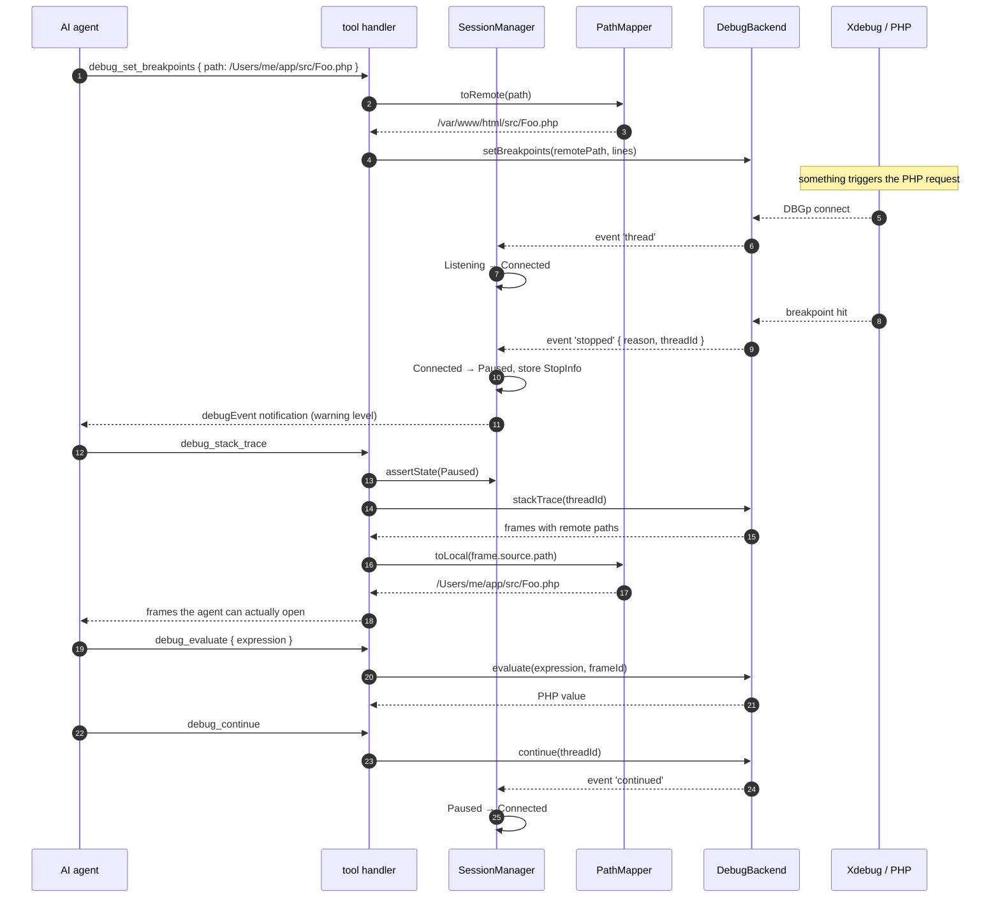

**How to read it.** Note where `PathMapper` appears: **outbound on the way in, inbound on the way
out.** Every path the agent supplies is translated to remote before it reaches DAP; every path DAP
returns is translated back to local before the agent sees it. A missing translation in either
direction shows up as "breakpoint never binds" or "agent cannot find the file it is standing in".

### 5.3 Breakpoint ledger — why DAP's model is not enough

> ⚠ **Status: built and tested, not wired in.** The diagram below shows the *designed* flow.
> `BreakpointLedger` implements every step, and property tests cover it. No shipped tool drives
> it yet, though. See [Wiring status](#wiring-status) below.

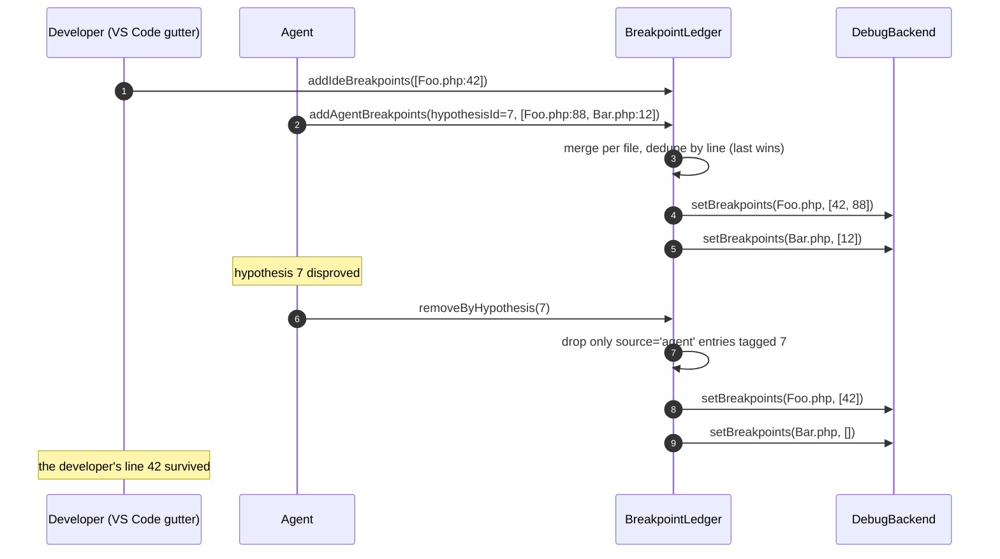

**The problem it solves.** DAP `setBreakpoints` is a **whole-file replacement** — there is no
"add one breakpoint" request. Naively sending the agent's breakpoints for `Foo.php` would silently
delete the developer's. The ledger keeps every breakpoint tagged with its origin
(`ide` | `agent` | `agent-untagged`), merges all origins per file before every sync, and supports
origin-scoped removal. `syncToDAP()` optionally takes a `vsCodeSync` callback so the same merge
logic can write through the VS Code breakpoint API instead of raw DAP.

#### Wiring status

The merge logic works. What's missing is the connection between it and the tools. The shipped
breakpoint path does not go through the ledger, so the whole-file problem described above is still
open.

| Piece | What it does today | Evidence |
|---|---|---|
| `debug_set_breakpoints` (both surfaces) | Sends `setBreakpoints` **straight to the adapter**, bypassing the ledger. It can replace breakpoints the developer set in the same file. Its description only warns the model: *"replaces all existing breakpoints in that file"*. | `tools/debug-set-breakpoints.ts:22`, `:58` |
| `vscode-agentic-debug` | Creates one ledger per session, and `debug_breakpoints_get` reads it. Nothing in the extension writes to it, so `debug_breakpoints_get` **always returns `[]`**. | `session-factory.ts:69`; `lm-tools.ts:332` |
| `vscode-debug-bridge` | `BreakpointSyncManager` sends gutter adds, removes and changes into the ledger. **Nothing reads the ledger or syncs it.** `getVsCodeSyncAdapter()` and `getHypothesisFlow()` are exported but never called. | `breakpoint-sync-manager.ts:67-85`; `extension.ts:60`, `:68`, `:96-109` |
| `debug_import_ide_breakpoints` (MCP) | Echoes its input back as `{ imported, breakpoints }`. It never touches the ledger or the adapter. | `tools/debug-import-ide-breakpoints.ts:28-48` |
| `addAgentBreakpoints`, `removeByHypothesis`, `syncToDAP` | No production callers. Exercised only by tests. | `vscode-debug-bridge/src/__tests__/breakpoint-sync.property.test.ts`, `vscode-agentic-debug/src/__tests__/breakpoints-get.property.test.ts` |

Two defects to fix when this is wired in:

- **The `vsCodeSync` path never removes anything.** `syncToDAP` calls only
  `vsCodeSync.addBreakpoints(merged)` (`breakpoint-ledger.ts:251-255`). As a result,
  `removeByHypothesis` followed by a VS Code sync leaves the disproved breakpoints in the editor.
- **An emptied file is skipped unless the caller names it.** When a file's last entry is removed,
  `removeByHypothesis` deletes the file's key. `syncToDAP()` with no `files` argument iterates the
  remaining keys, so it never sends `setBreakpoints(Bar.php, [])` and the agent's breakpoint stays
  live in the adapter. Callers must pass the file list that `removeByHypothesis` returns.

### 5.4 `debug_wait` — blocking on an event instead of polling for it

`src/tools/debug-wait.ts` is the 21st handler, registered on both surfaces — as MCP tool #21 and
as the `debug_wait` LM tool. It replaces the pattern every agent
otherwise invents on its own — call `debug_status`, see `listening`, call `debug_status` again —
with a single call that returns when something actually happens.

That matters for more than elegance. A polling loop costs one model turn per poll: each
`debug_status` result goes back through the context window and the model pays to decide whether to
poll again. `debug_wait` collapses an unbounded number of those turns into one tool call whose
latency is spent inside the extension host, not inside the model.

**Input** — `debugWaitSchema`: a single optional `timeout` (ms, default `30000`).
**Output** — a `successResult` in **all four** outcomes. `debug_wait` never returns an error result
except when there is no session at all, and that check lives in the LM tool wrapper, not the handler.

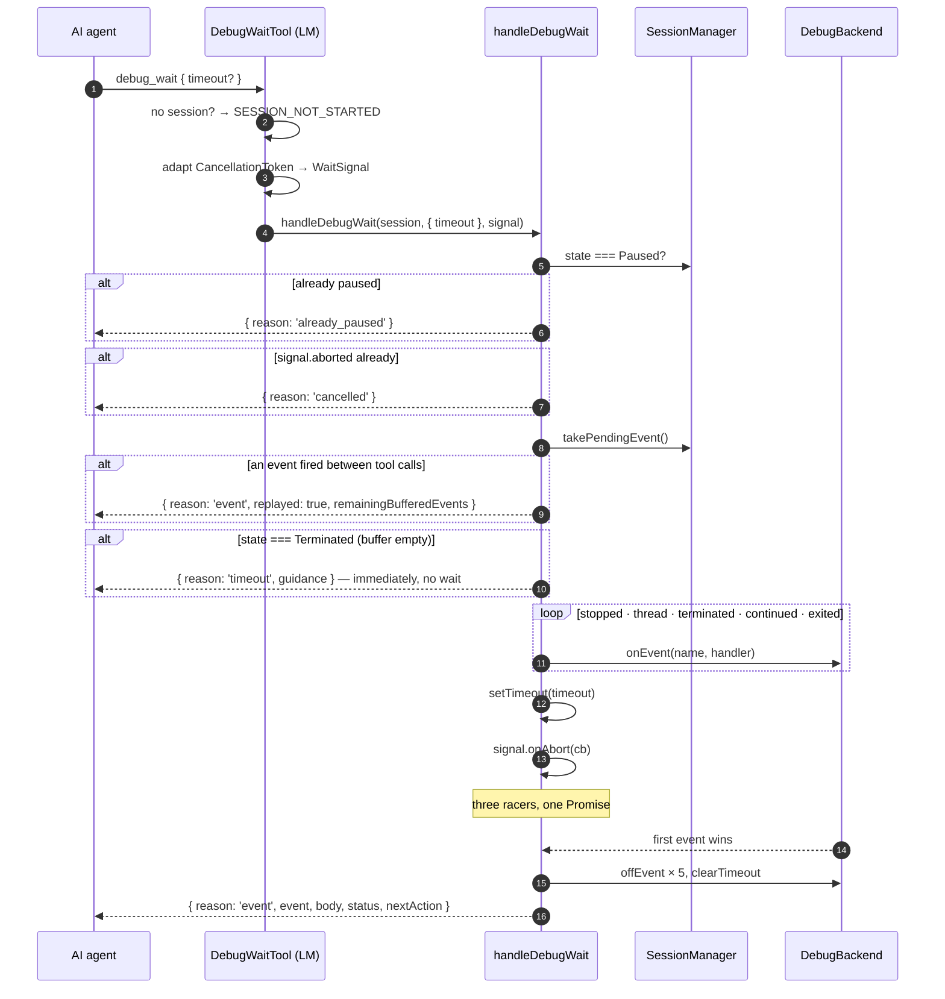

#### The four resolution paths

| `reason` | Trigger | `event` / `body` | Extra fields |
|---|---|---|---|
| `already_paused` | `session.state === Paused` on entry. Clears the event buffer and returns before registering anything. | `null` / `null` | `nextAction` → `debug_stack_trace` |
| `event` (replayed) | A buffered event is waiting on entry. Replays the oldest one and does not block. | event name / `body ?? {}` | `replayed: true`, `remainingBufferedEvents`, `nextAction` → `debug_wait` again while more are buffered |
| `event` (live) | First of `stopped`, `thread`, `terminated`, `continued`, `exited` to fire | event name / `event.body ?? {}` | `nextAction` |
| `timeout` | `setTimeout(timeout)` fires first. Returned **immediately** if the session is `Terminated` and the buffer is empty, since no event can arrive. | `null` / `null` | `nextAction` **and** per-state `guidance` |
| `cancelled` | `signal.aborted` on entry, or `onAbort` fires first | `null` / `null` | `nextAction` → `debug_status` |

Every payload also carries `status: SessionStatus`, so the model never needs a follow-up
`debug_status` to learn what state the wait left it in.

#### Event replay — nothing is lost between two tool calls

Listeners are registered only for the duration of a `debug_wait` call, but events can arrive
between calls: PHP connects while the model is still deciding what to do, or a script finishes
before the next wait. So `SessionManager` buffers each of the five `WAIT_EVENTS` in its own
handler, through `bufferEvent()` (`session.ts:661`, called at `:716`, `:741`, `:750`, `:768`,
`:799`). The buffer holds at most `MAX_PENDING_EVENTS = 100` events and drops the oldest first.
`handleDebugWait` removes one event with `takePendingEvent()` (`debug-wait.ts:120-137`) **before**
it registers any listener. Each call returns at most one replayed event, so a backlog takes one
call per event.

Three rules keep replayed events from being stale:

- **A `stopped` event is never reported twice.** `already_paused` clears the buffer, because that
  result already reports the stop. When a thread resumes, `markResumed()` drops any buffered
  `stopped` event from that suspension or earlier (`session.ts:283-288`). Events of every other
  type stay in the buffer.
- **An event caught live is not replayed.** `SessionManager`'s handlers run before the wait's
  listener (they are registered at launch), so every event a live `debug_wait` catches has already
  been buffered. The listener calls `consumePendingEvent(event)`, which removes that object from the
  buffer. Without this, every live `thread`, `continued`, `terminated` or `exited` was reported a second
  time by the next wait. Further events in the same burst arrive after the listener is removed and
  stay buffered, so the next wait replays them exactly once.
- **A terminated session does not block.** If the buffer is empty and the state is `Terminated`,
  the call returns a `timeout` result with `guidance` straight away instead of waiting the full
  timeout (`debug-wait.ts:139-150`).

Property 9 in `debug-wait.property.test.ts` covers this. It checks that an event fired before the
wait is replayed without blocking, and that a buffered `stopped` is reported as `already_paused`
and not replayed again. Against the code before the fix, those properties hang for the full 30 s.

**A timeout is not a failure, and the payload says so.** This is the one design decision in the file
that came directly from watching Copilot give up mid-session: a bare `{reason: 'timeout'}` reads to
an LLM as "something broke, ask the human". So the timeout branch looks up `timeoutGuidance[state]`
and returns the *reason nothing happened*, phrased as the next move:

| State when the timer fired | `guidance` |
|---|---|
| `listening` | Xdebug has not connected yet. Ensure PHP execution is triggered, then retry `debug_wait`. |
| `connected` | Execution has not hit a breakpoint. Verify breakpoint placement or retry `debug_wait`. |
| `initializing` | Session is still initializing. Retry `debug_wait` shortly. |
| `terminated` | Session has ended. Call `debug_launch` to start a new session. |
| `not_started` | No active session. Call `debug_launch` to start debugging. |

#### The invariant: one settle, zero leaked listeners

Five event listeners, a timer and a cancellation callback race for one `resolve`. The guard is a
`settled` flag inside a single `cleanup()` that every path calls first:

```ts
const cleanup = () => {
  if (settled) return;        // idempotent — an event and the timer can fire in the same tick
  settled = true;
  clearTimeout(timer);
  for (const { eventName, handler } of handlers) backend.offEvent(eventName, handler);
};
```

Without it, a 30-minute debugging session leaves five dead listeners on the backend per
`debug_wait` call, and the backend dispatches over a `[...handlers]` copy, so they keep firing. This
is what the property tests pin down — `src/__tests__/debug-wait.property.test.ts`, fast-check:

| Property | What it asserts |
|---|---|
| 1 — Already-paused immediate return | Any `StopInfo`, any timeout → `already_paused` without registering |
| 2 — Event resolution correctness | Resolved `event`/`body` match what the backend emitted |
| 3 — First-event-wins | With N events fired, the result names the first |
| 4 — Cleanup on all paths | `offEvent` count == `onEvent` count after event, timeout **and** cancellation; cleanup runs exactly once when event and timer race |
| 5 — Timeout resolution | Any positive timeout → `timeout`, `null` event/body, valid status |
| 6 — Cancellation resolution | Abort before and during the wait both yield `cancelled` |
| 8 — Timeout guidance existence | Every state produces a non-empty `guidance` string |

#### Why the handler knows nothing about VS Code

`handleDebugWait` takes a `WaitSignal` — `{ aborted, onAbort }` — not a
`vscode.CancellationToken`. The adaptation is four lines in the LM tool (`lm-tools.ts:385`):

```ts
const signal = {
  get aborted() { return token.isCancellationRequested; },
  onAbort(cb: () => void) { token.onCancellationRequested(cb); },
};
```

`aborted` is a **getter**, not a snapshot, so a token cancelled between construction and the
handler's check is still seen. That two-property interface is why the wait logic sits in the core
next to the other 20 handlers instead of in the extension: nothing in it imports `vscode`, and the
MCP server could register it tomorrow by supplying an `AbortSignal`-shaped object.

#### Backend symmetry — both backends deliver the adapter's real events

| Backend | How the five events arrive | Wait latency |
|---|---|---|
| `DAPClient` (headless) | Real DAP events parsed off the adapter's stdout, dispatched synchronously | microseconds after the adapter emits |
| `VsCodeDebugBackend` (ui) | Real DAP events tapped from `vscode.debug.registerDebugAdapterTrackerFactory`'s `onDidSendMessage` | microseconds after the adapter emits |

VS Code does not forward standard DAP events (`stopped`, `continued`, `thread`, `output`) through
`onDidReceiveDebugSessionCustomEvent` — that carries only *custom* ones, because VS Code consumes
the standard ones for its own UI. A debug adapter tracker is the only API that sees them, and both
backends therefore report the real `reason` and the real body.

##### Why not polling (do not reintroduce it)

UI mode originally synthesised events from a 500 ms `setInterval` that inferred state from `threads`
+ `stackTrace`: frames returned ⇒ `stopped`, threw or returned none ⇒ `continued`. Both halves are
false against vscode-php-debug, and the two errors compounded:

1. `setupConnection()` registers a connection in `_connections` the instant the TCP socket opens —
   before the init packet, ~6–12 feature round-trips, `_donePromise` and every `breakpoint_set`.
   The engine is suspended waiting for commands through all of it, so `stack_get` succeeds and
   returns the script entry point. A poll landing in that window reported a `breakpoint` stop
   before PHP had executed a line, moving SessionManager to `Paused`.
2. Once PHP *was* running, `Connection._enqueue()` puts `stack_get` in `_commandQueue` behind the
   pending `run` execute command, where it neither resolves nor rejects until the next stop. So the
   poller's `lastKnownState` stayed latched at `'paused'` while execution ran, and no `continued`
   was ever emitted — which made its own `lastKnownState !== 'paused'` guard discard the real
   breakpoint hit when it finally arrived.

Observable symptom: `debug_wait` returned `already_paused` pointing at `index.php`, or blocked for
its full timeout while the editor sat visibly paused at the breakpoint (VS Code had the real
`StoppedEvent`; only the agent's bridge did not). The poller also queued one `stack_get` per tick —
~60 over a 30 s wait — all of which drained at the moment of the real stop.

Regression cover: `vscode-agentic-debug/src/__tests__/ui-event-bridge.test.ts`.

#### Known gaps

- ~~**No event replay.**~~ Fixed: all five `WAIT_EVENTS` are buffered and replayed before the
  wait blocks. See [Event replay](#event-replay--nothing-is-lost-between-two-tool-calls) above.
- **`nextAction` does not depend on the event.** A live event always returns *"Call
  debug_stack_trace to inspect where execution stopped"*. So does a replayed event once the buffer
  is empty. That includes `terminated` and `continued`, where the advice is wrong. Per-event text was specified in
  [`agentic-debug-session-recommendations.md`](../agentic-debug-session-recommendations.md) §4.1 and
  never implemented.
- **`WaitResult` under-declares the payload.** The interface lists `reason`, `event`, `body`,
  `status`, `replayed?` and `remainingBufferedEvents?`. Every return also includes `nextAction`,
  and timeout results include `guidance`, but neither is declared. The
  handler returns `successResult(data: unknown)`, so nothing type-checks the difference.
- **The cancellation subscription is never disposed.** `token.onCancellationRequested(cb)` returns a
  `Disposable` that the adapter drops; one subscription per invocation lives until the token does.
- ~~**Advertised where it does not exist.**~~ Fixed: `debug_wait` is now registered over MCP too
  (`tools/index.ts:267`), so `allowedToolsByState` (`debug-status.ts:17`) listing it for
  `listening`, `connected` and `paused` is accurate in both front-ends. See §4.1.

### 5.5 Plan runs — a debug session with no model in the loop

Plan mode (`--mode plan`, `src/plan/`) executes a declarative plan written before anything runs.
The runner (`runner.ts`) only ever calls tools, through a `ToolInvoker`:

| Invoker | Where | What a run exercises |
|---|---|---|
| `InProcessInvoker` (`plan/invoker.ts`) | the MCP server's `debug_plan_run`, `php-debug-plan --via in-process` | the handlers, through each tool's own Zod schema |
| `McpClientInvoker` (`plan/mcp-invoker.ts`) | `php-debug-plan --via mcp-stdio` / `mcp-http=` | the whole server: transport, SDK validation, registration, serialization |
| `ExtensionInvoker` (`vscode-agentic-debug/src/plan-runner.ts`) | LM tool `debug_plan_run`, command *Run Debug Plan…* | `SessionFactory` and the UI backend |

A `JournalingInvoker` records every call; the journal is what explains a golden mismatch.

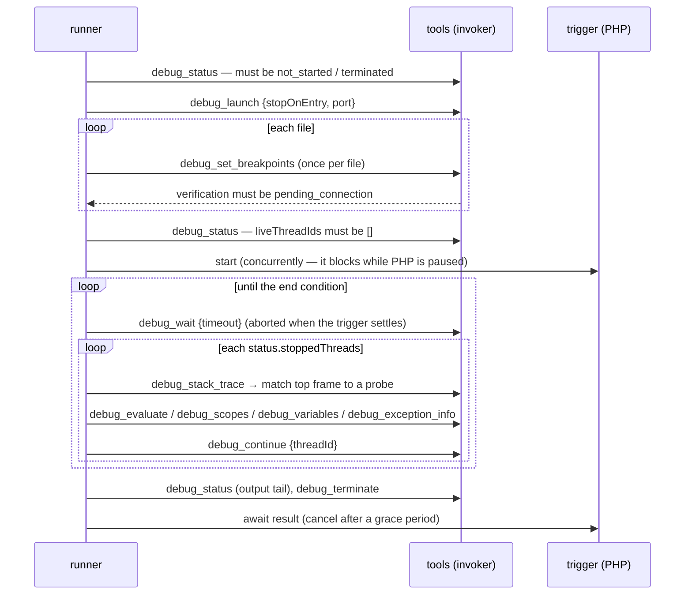

The invariants, each with the fact that forces it:

- **"Flush" is registering while listening.** Breakpoints live in the adapter's
  `BreakpointManager` and every new connection replays them before PHP runs (§5.1), which the tools
  report as `pending_connection`. Any other status fails `initialize`.
- **No adapter `program` mode.** With `program` the adapter spawns PHP inside `launchRequest`, and
  `launch()` sends `configurationDone` before any tool can set a breakpoint. The connection arrives
  while the state still reads `listening`, so the runner also requires `liveThreadIds` to be empty
  (and a `stateWarning` from `debug_set_breakpoints` fails the run). Plans start PHP with their own
  trigger instead.
- **Stops are matched by location.** vscode-php-debug's `StoppedEvent` carries no
  `hitBreakpointIds` (`phpDebug.ts:825`); the top frame's `file:line` (symlinks resolved, and the
  adapter's resolved line accepted) identifies line probes, the frame name identifies function
  probes, `reason: "exception"` the exception probe.
- **The loop is state-driven.** `debug_wait` returns `already_paused` (and clears the buffer) when
  any thread is suspended, so the runner handles every entry of `status.stoppedThreads`, not just
  the event's thread — several Xdebug connections can be suspended at once.
- **Each file's breakpoints are sent once.** Re-sending resets every hit counter in the file.
- **It ends on evidence, never on a guess.** Completed = the trigger settled, nothing is paused, no
  connection is live, and `idleMs` passed quietly. Otherwise `no_connection`, `timeout`,
  `max_stops`, `cancelled` or `failed` — and teardown runs in every case.

**Reproducibility.** `normalizeReport()` drops ids, pids, timings, the surface, validation warnings,
`volatile` expressions and exception free text, rewrites paths under the plan root to `${root}`, and
renumbers threads. A golden file is a normalized report; `e2e/plans.e2e.test.ts` requires the
in-process and MCP-stdio runs of every plan to equal it against real Xdebug.

**ReAct counterpart.** `debug_snapshot` (and `debug_wait {snapshot}`) reuse the runner's capture
engine (`plan/capture.ts`) and redaction (`plan/redact.ts`), and diff each observation against the
thread's previous one. Its per-session state lives in a `WeakMap` keyed by `SessionManager`;
`SessionManager.launchCount` tells a relaunch apart, since thread ids restart at 1.


---

## 6. Component reference

### 6.1 `index.ts` — entry point and transport

CLI bootstrap (`parseArgs`), config load, transport selection, component wiring.

- **stdio transport** — one `McpServer + SessionManager + DAPClient` stack for the process lifetime.
- **Streamable HTTP transport** — a fresh stack per MCP session via the `createMcpStack()` factory,
  keyed by the `mcp-session-id` header:

  | Route | Behaviour |
  |---|---|
  | `POST /mcp` *without* session id + `initialize` body | create a new session |
  | `POST /mcp` *with* session id | route to that session's transport |
  | `GET /mcp` | SSE stream for push notifications |
  | `DELETE /mcp` | tear the session down |

  `beforeExit` cleans up every live session.
- `--verbose 1` forwards adapter stderr; `--verbose 2` adds the full raw DAP trace, both as MCP log
  notifications.

### 6.2 `config.ts` — configuration

A single `ConfigSchema.parse(json)` call validates and applies defaults; `Config` is `z.infer` of the
schema, so type and validation can never drift apart. `adapterPath` is the only required field.
Notable groups: `pathMappings` (`Record<remote, local>`), the PHP launch fields (`program`, `args`,
`cwd`, `runtimeExecutable`, `env`, `envFile`), and the nested optional `xdebugSettings`, `proxy`,
`stream` blocks.

### 6.3 `session.ts` — SessionManager

The orchestrator: owns the state machine of §4, the DAP event routing, the queued-breakpoint window,
and the progress/log/event notification calls. Constructor-injected with `Config`, `DebugBackend`,
`PathMapper`, `NotificationSender` — all four are interfaces or plain data, which is what makes the
class trivially testable and backend-agnostic.

`syncFromExternalSession()` is the attach path for a session the developer started with F5. It
registers handlers and jumps straight to `Listening` or `Connected` depending on
`backend.isAlive()`, from whatever state the session is in. Its only caller is the superseded
`vscode-debug-bridge`. `vscode-agentic-debug` attaches differently: `VsCodeDebugBackend.launch()`
reuses a live PHP session if it finds one, so it still goes through `launch()`.

### 6.4 `dap-client.ts` + `dap-framing.ts` — the wire

`DAPClient` spawns `node <adapterPath>`, assigns incrementing `seq` numbers, and keeps a
`Map<seq, {resolve, reject}>` of in-flight requests keyed by the response's `request_seq`. On
process exit every pending request is rejected **with the captured stderr appended**, which is what
turns an adapter crash into a diagnosable error instead of a 30-second timeout. If the adapter had
not already reported `terminated` or `exited`, the client then sends a synthetic
`terminated { adapterExited: true, exitCode }` to its handlers, so the session and any blocked
`debug_wait` learn that the adapter is gone.

The exit listener and the stream parser work only on the *current* process.
`disconnect()` first detaches the process by setting `process = null`, then rejects any in-flight
requests with `DAP adapter disconnected`, and only then kills the process. So an intentional kill
is not reported as a crash. It also means a late `exit` from an old process cannot mark a
relaunched client as dead or reject that client's requests.

`DAPStreamParser` implements `Content-Length: N\r\n\r\n{json}` framing as a stateful streaming
parser: it must survive a message split across chunks and several messages inside one chunk.
`frameMessage(obj)` is the encoder.

### 6.5 `path-mapper.ts`

Longest-prefix matching, mappings pre-sorted by prefix length descending, first match wins. Pure
string work — no filesystem access, no `path.resolve`, so it behaves identically whether the remote
side is Linux-in-Docker or a remote host.

### 6.6 `notifications.ts`

`McpNotificationSender` adapts `SessionManager`'s three notification calls onto the MCP SDK:
`server.notification()` for progress, `sendLoggingMessage()` for logs and debug events. Debug events
use the logger name `agentic-php-debug/debugEvent` so clients can filter them out of ordinary logs;
`stopped` is emitted at `warning` level, everything else at `info`.

### 6.7 `breakpoint-ledger.ts`

See §5.3 for the rationale. Storage is `Map<file, LedgerEntry[]>`. The standalone MCP server does
not use it, because breakpoints there come from one place, so sending `setBreakpoints` directly is
enough. The ledger is meant for the editor integrations, where IDE and agent breakpoints have to
coexist. Neither extension routes breakpoint writes through it yet (§5.3,
[Wiring status](#wiring-status)).

### 6.8 `tools/` — the handler layer

21 modules, each exporting `schema` (Zod), `description` (the text the model actually reads), and
`handler(session, args, …)`. `tools/index.ts` wires all 21 onto an `McpServer`;
`tools/schemas.ts` is a barrel re-exporting every schema and inferred input type for downstream
consumers.

**MCP tool catalog (registered by `registerAllTools`)**

| Category | Tools | Required state |
|---|---|---|
| Session lifecycle | `debug_launch`, `debug_terminate`, `debug_status` | `NotStarted` / any / any |
| Execution control | `debug_continue`, `debug_next`, `debug_step_in`, `debug_step_out`, `debug_pause` | `Paused` (`pause` needs `Connected`) |
| Breakpoints | `debug_set_breakpoints`, `debug_set_function_breakpoints`, `debug_set_exception_breakpoints`, `debug_import_ide_breakpoints` | `Listening` \| `Connected` \| `Paused` — sent immediately in all three (see §5.1) |
| State inspection | `debug_stack_trace`, `debug_scopes`, `debug_variables`, `debug_evaluate`, `debug_set_variable`, `debug_source`, `debug_exception_info` | `Paused` |
| Threading | `debug_threads` | any active state |
| Waiting | `debug_wait` | any. Replays a buffered event, or blocks until an event, a timeout or cancellation (§5.4) |

`debug_wait` is tool #21 and is registered on both surfaces. Over MCP, the SDK's `AbortSignal` is
converted to a `WaitSignal` (`toWaitSignal`, `tools/index.ts:277-284`).

`registerAllTools` also takes `isVsCodeBackendActive`. When it is true, `debug_import_ide_breakpoints`
adds a notice saying IDE breakpoints are synchronized automatically. That notice overstates things:
the tool only echoes its input back, and the bridge's gutter-to-ledger sync never reaches the
adapter (§5.3, [Wiring status](#wiring-status)).

### 6.9 `vscode-agentic-debug` surface

**18 Language Model Tools** declared in `package.json` → `contributes.languageModelTools` and
registered in `lm-tools.ts`. Both the `inputSchema` and the `modelDescription` of every tool with a
core counterpart are **generated** from the core's exported Zod schemas (`tools/schemas.js`) and
description constants (`tools/descriptions.js`). The extension repo owns that sync and its drift
check — edit the Zod schema or the `debug*Description` constant, never the manifest:

| LM tool | Backed by |
|---|---|
| `debug_launch`, `debug_terminate` | `SessionFactory.launch/terminate` → core `handleDebugLaunch` / `handleDebugTerminate` |
| `debug_status`, `debug_threads`, `debug_continue`, `debug_next`, `debug_step_in`, `debug_step_out`, `debug_pause`, `debug_stack_trace`, `debug_scopes`, `debug_variables`, `debug_evaluate`, `debug_wait` | the core handler of the same name |
| `debug_set_breakpoints`, `debug_set_exception_breakpoints`, `debug_exception_info` | the core handler of the same name |
| `debug_breakpoints_get` | `BreakpointLedger.getForFile` — the only tool with no core handler |

Every shared tool now uses the core's own name. `debug_breakpoints` was renamed to
`debug_set_breakpoints`, which was the last remaining rename: `debug_status`'s `allowedTools` and
several handlers' `nextAction` strings name core tools in prose, so a divergent name on this surface
pointed the agent at a tool that did not exist.

Four core tools are **not** exposed in-editor: `set_function_breakpoints`, `set_variable`, `source`,
`import_ide_breakpoints`.

> **Extension-only launch properties.** `backendMode`, `pathMappings`, `hostname` and `log` exist
> only in the extension's `package.json` tool schema, and deliberately so: `SessionFactory.buildConfig`
> consumes them to assemble the `Config` *before* the core handler runs, while `handleDebugLaunch`
> forwards only `stopOnEntry` and `port` to `session.launch()`. Adding them to `debugLaunchSchema`
> would make the MCP server accept and silently ignore them. The extension's schema sync must
> therefore tolerate and preserve them rather than delete them.

---

## 7. Cross-cutting concerns

### Error handling
Every handler is `try/catch` → `errorResult(message, code)` with a machine-readable code from
`ErrorCodes`. No exception escapes a tool call; the agent always receives a `ToolResult` envelope.
Adapter crashes surface through pending-request rejection with stderr context attached.

### Testability
Four seams carry the whole test strategy:

| Seam | Lets tests… |
|---|---|
| `DebugBackend` | run every tool handler against a scripted fake adapter |
| `ProcessSpawner` | exercise `DAPClient` with no real child process |
| `NotificationSender` | assert on emitted progress/log/debug events |
| Handlers as pure `(session, args) → ToolResult` | call them directly, no MCP server needed |

Zod schemas double as runtime validation and compile-time types, so property tests can generate
valid inputs straight from the schema.

### Multi-backend architecture
The `DebugBackend` interface is what makes two deployment modes possible from one codebase:
**headless** (`DAPClient` spawns `phpDebug.js`; no editor) and **ui** (`VsCodeDebugBackend` drives
`vscode.debug`; the developer watches it happen). `backendMode` is a `debug_launch` *tool parameter*
defaulting to `"ui"` — not a VS Code setting.

The modes map onto the two front ends: the extension exists to deliver **ui**, and the MCP server is
the **headless** front end. `backendMode: "headless"` inside the extension is an escape hatch for
comparing both backends against one workspace config, not the way to debug without an editor — for
that, run the MCP server. As of the debug-adapter-tracker work documented in §6.8, both modes see
the adapter's real DAP events, so neither is the coarser of the two.

### Package exports
`package.json` declares an explicit `exports` map exposing individual modules
(`./session.js`, `./breakpoint-ledger.js`, `./tools/debug-variables.js`, …) so the extensions import
exactly what they need without pulling in the CLI entry point and its transport dependencies.

---

## 8. File map

| File | Component | Purpose |
|---|---|---|
| `index.ts` | Entry point | CLI, transport selection, `createMcpStack()` wiring |
| `config.ts` | `ConfigSchema`, `loadConfig` | Zod validation, defaults, serialization |
| `session.ts` | `SessionManager` | State machine, DAP event routing, handshake |
| `debug-backend.ts` | `DebugBackend` | The interface both backends implement |
| `dap-client.ts` | `DAPClient`, `ProcessSpawner` | Child-process DAP implementation |
| `dap-framing.ts` | `DAPStreamParser`, `frameMessage` | `Content-Length` framing codec |
| `path-mapper.ts` | `PathMapper` | Longest-prefix local ↔ remote translation |
| `notifications.ts` | `McpNotificationSender` | `NotificationSender` over the MCP SDK |
| `breakpoint-ledger.ts` | `BreakpointLedger` | Multi-origin breakpoint registry |
| `tools/types.ts` | `ToolResult`, `ErrorCodes` | Response envelope and error vocabulary |
| `tools/index.ts` | `registerAllTools`, `ServerMode` | Registers the tools of a mode (`react`, `plan`, `all`) on an `McpServer` |
| `tools/registry.ts` | `coreToolDefinitions`, `planToolDefinitions` | The one table of tools: name, description, schema, runner |
| `plan/schema.ts` | `DebugPlanSchema` | The plan format (Zod; JSON Schema in `schemas/`) |
| `plan/validate.ts` | `validatePlan` | Semantic checks, defaults, `${…}` interpolation, plan hash |
| `plan/runner.ts` | `runPlan` | initialize → execute → teardown → report (§5.5) |
| `plan/capture.ts` | `captureStop` | Stack, evaluate, locals and exception capture through tools |
| `plan/trigger.ts` | `startTrigger` | Command / HTTP / manual triggers |
| `plan/report.ts` | `normalizeReport`, `evaluateExpectations` | Report, golden comparison, verdicts, summary |
| `plan/invoker.ts`, `plan/mcp-invoker.ts` | `ToolInvoker` | Where a plan's tool calls go |
| `plan/store.ts` | `RunStore` | Finished runs for `debug_plan_report` and resources |
| `plan/cli.ts` | `php-debug-plan` | Runs a plan with no agent |
| `prompts/` | `registerPrompts` | `debug_plan` / `debug_react` prompts, plan resources |
| `tools/schemas.ts` | barrel | Re-exports all Zod schemas and input types |
| `tools/debug-*.ts` | 21 handler modules | `schema` + `description` + `handler` |
